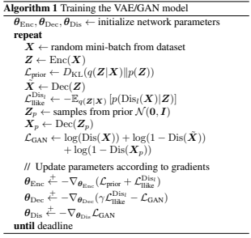

**World Models - Task 3 Final Report**

Since VAE models are unsupervised, we would like to add GAN models which are supervised by merging them so they have the efficiency of VAE models while maintaining which data is useful and which isn’t. A VAE will usually input the value into an encoder and use a decoder to turn the image into an image that is processable. The GAN model uses a generator that pretty much does what a decoder does and a discriminator to assign probability to the value in order to find a binary classifier that gives the best possible discrimination between true and generated data.  A VAE/GAN expands on the decoder by using it as a generator using the generated value, and the original value, and using a discriminator to generate the GAN result. The result will be an unsupervised generative model that simultaneously learns to encode, generate, and compare dataset samples.

The picture above depicts an algorithm provided by the “Autoencoding beyond pixels using a learned similarity metric” paper which demonstrates the steps VAE/GAN takes per step

Our goal is to add a discriminator into the current VAE model and the way we implemented it was by using this [model](https://colab.research.google.com/github/timsainb/tensorflow2-generative-models/blob/master/6.0-VAE-GAN-fashion-mnist.ipynb#scrollTo=k9SohQvnTSch).

The way they used an encoder/decoder was similar to the VAE used in the world-model, with the addition of a discriminator. We used this VAEGAN model which some minor adjustments to create our [VAEGAN model](WorldModels/vaegan/vaegan.py). Training the model was done in [vaegan_train.py](WorldModels/vaegan_train.py) which heavily used vae_train.py as a basis for collecting the dataset and outputting the dataset/model so it could be used when running series and RNN. We did not finish this section as we ran out of time testing our code against the model, and tweaking some parameters such as latent loss, learning rate, and adding/removing layers in the discriminator and generator.

